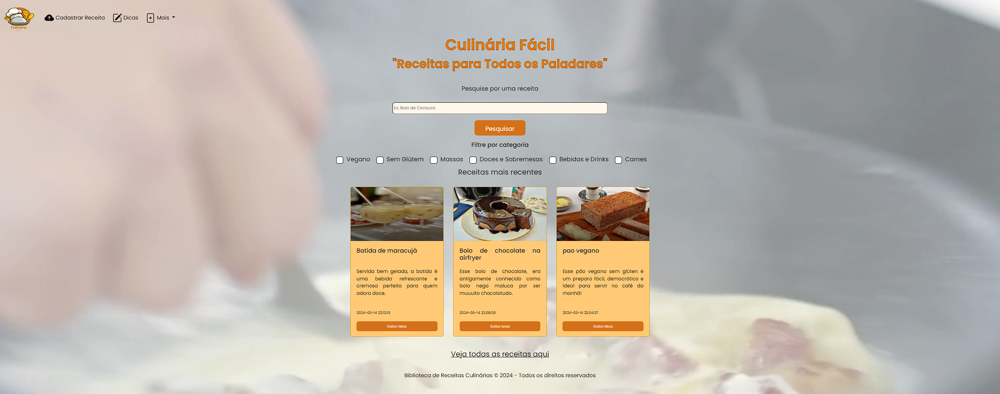
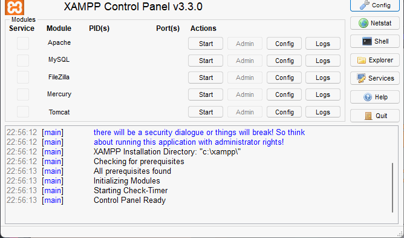
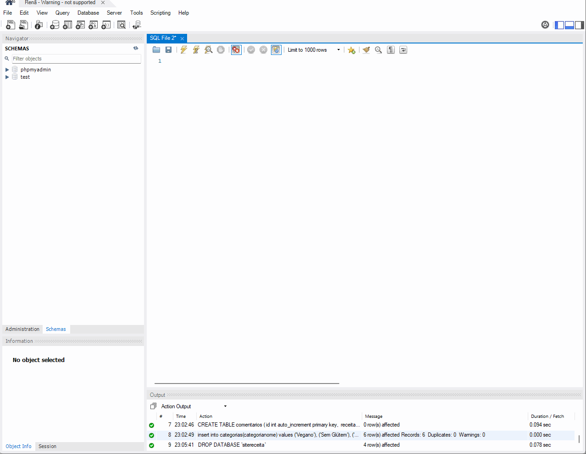

<h1 align="center"> Culinária Fácil </h1>

Projeto desenvolvido durante o curso de administrador de banco de dados - SENAC-MA.

  <a href="#-tecnologias">Tecnologias</a>&nbsp;&nbsp;&nbsp;|&nbsp;&nbsp;&nbsp;
  <a href="#-ferramentas">Ferramentas</a>&nbsp;&nbsp;&nbsp;|&nbsp;&nbsp;&nbsp;
  <a href="#-instalacao">Instalação</a>&nbsp;&nbsp;&nbsp;|&nbsp;&nbsp;&nbsp;

  <a href="#-projeto">Projeto</a>&nbsp;&nbsp;&nbsp;|&nbsp;&nbsp;&nbsp;
   <a href="#-aprendizado">Aprendizado</a>&nbsp;&nbsp;&nbsp;|&nbsp;&nbsp;&nbsp;
  <a href="#memo-licença">Licença</a>

  

 

  

## 🚀 Tecnologias

Esse projeto foi desenvolvido com as seguintes tecnologias:

- HTML e CSS
- JavaScript
- SQL
- Bootstrap
- Python
- Git e Github

## 🚀 Ferramentas
- MySQL
- Xampp
- Trello

## 💻 Instalação

 No terminal VSCode instale:
<b><i>
- <b><i> $ pip install -U Flask </b></em>
- <b><i>$ pip install Bcrypt-Flask</b></em>
- <b><i>$ pip install mysql-connector</b></em>

- Dentro do Xampp inicie o "MySQL" 

  

- No Sistema de gerenciamento de banco de dados cole o script do arquivo "banco_de_dados" disponível em <b><i> Culinaria_Facil\banco_de_dados\banco_de_dados.sql" </b></em>

  

## 💻 Projeto

- <b>Biblioteca Digital de Receitas Culinárias</b> 

- Público-Alvo: 

Amantes da culinária, chefs amadores, entusiastas de comida, pessoas interessadas em aprender novas receitas e técnicas culinárias.

- Objetivo do Projeto:

Por meio de um banco de dados fornecer uma ampla coleção de receitas, sobre técnicas culinárias, dicas de cozinha e inspiração para pessoas que gostam de cozinhar e experimentar novos pratos.

- Recursos Principais:  

Receitas Categorizadas: Organização por categoria ( Sem glúten, doces, 
sobremesas, vegano, massas, carnes, bebidas e drinks).

- Pesquisa Avançada: 

Funcionalidade de pesquisa por ingredientes, tempo de preparo, nível de dificuldade, etc.

- Perfil do Usuário: 

Funcionalidade de pesquisa por ingredientes, tempo de preparo, nível de dificuldade, etc.

## 📚 Aprendizado

Esse projeto permitiu aos alunos aplicarem na prática os conhecimentos adquiridos sobre bancos de dados e desenvolvimento web.

- Planejamento e Design:

Os alunos iniciaram o projeto com a definição do escopo e planejamento das funcionalidades do site. Foi criada uma estrutura de banco de dados que suportasse as diversas funcionalidades, como armazenamento de receitas, categorias, ingredientes, e usuários.

- Modelagem do Banco de Dados:

A modelagem do banco de dados envolveu a criação de tabelas para receitas, categorias, ingredientes e usuários, com relações bem definidas entre elas. Foram utilizados conceitos de normalização para evitar redundâncias e garantir a integridade dos dados.

- Desenvolvimento do Backend:

Utilizando Python, e frameworks como Flask, os alunos desenvolveram a lógica do servidor para gerenciar as operações do banco de dados (CRUD - Create, Read, Update, Delete).

- Desenvolvimento do Frontend:

No frontend, os alunos usaram tecnologias como HTML, CSS e JavaScript, junto com framework Bootstrap, para criar uma interface de usuário interativa e responsiva. A interface permitia que os usuários pesquisassem, visualizassem, e adicionassem receitas.

- Integração e Testes:

Após o desenvolvimento, os alunos integraram o frontend e o backend, garantindo que todas as funcionalidades estavam funcionando corretamente. Foram realizados testes para identificar e corrigir bugs, além de otimizar a performance do site.

- Apresentação:

Ao final, os alunos apresentaram o site de biblioteca de receitas culinárias, demonstrando suas funcionalidades e a eficácia do banco de dados implementado.

## :memo: Licença

Esse projeto está sob a licença MIT.

